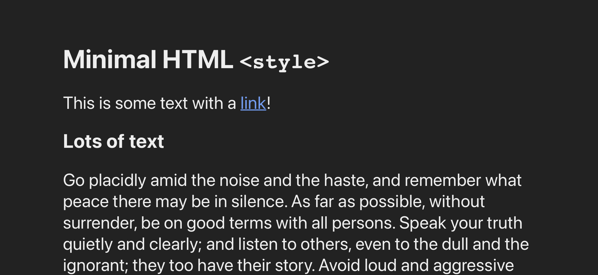
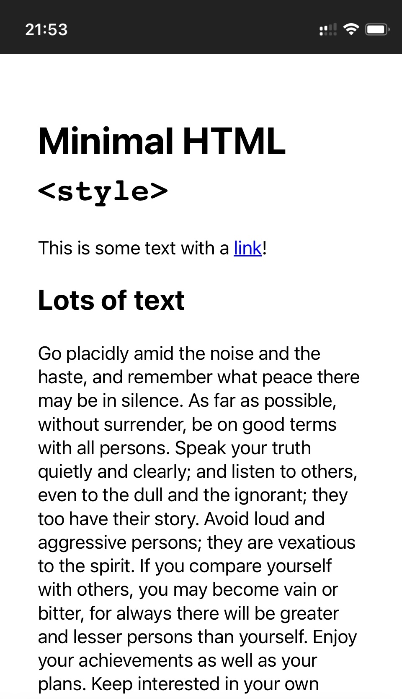
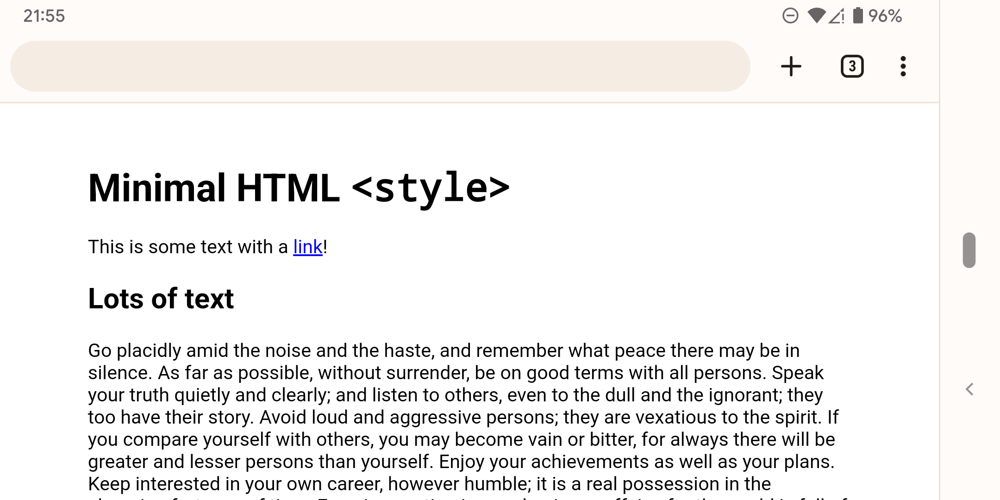
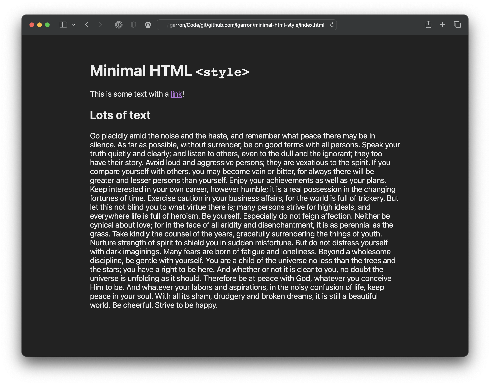
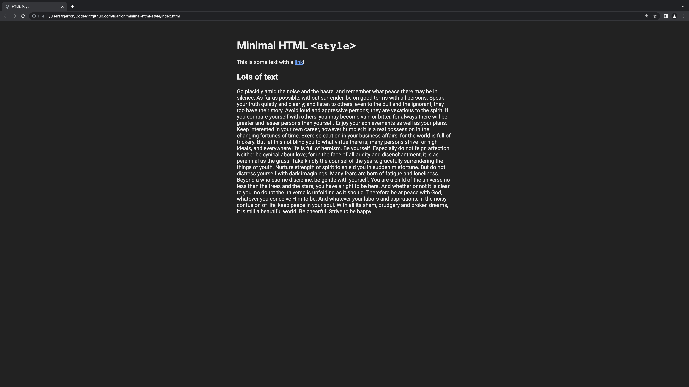
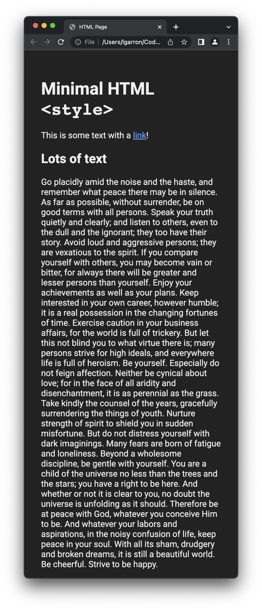

# Minimal HTML `<style>`

An HTML style snippet that looks nice on all devices while being as small as possible.

## Snippet

Place in the `<head>` of a page:

```html
  <!-- From: https://github.com/lgarron/minimal-html-style (v1.0.0) -->
  <meta name="viewport" content="width=device-width, initial-scale=0.75">
  <style>
    html {
      font-family: -apple-system, Roboto, Ubuntu, Tahoma, sans-serif;
      font-size: 1.25rem; padding: 2em;
      display: grid; justify-content: center;
    }
    body { width: 100%; max-width: 40em; margin: 0; }
    @media (prefers-color-scheme: dark) {
      html { background: #000D; color: #EEE; }
      a { color: #669df5; }
      a:visited { color: #af73d5; }
    }
  </style>
```

See [`index.html`](./index.html) for more.

## Explanation

The snippet makes these opinionated choice:

- **Sans-serif font** — for less-cluttered screen display.
- **Slightly larger font** — for easier reading, especially for pages with very few (even one) line of text.
- **Horizontally centered text** — for visual balance.
- **Limited column width** — for easier reading and scanning on large screens, automatically adjusting ("responsive") to fill smaller screens.
- **Dark mode** — with corresponding text and link color fixes.
- **Mobile viewport scaling** — to prevent very small text size on mobile screens.

Excluded choices:

- No **vertical centering** — this can interfere with other CSS too easily.
- No **general resets** — this is not a CSS framework, just a way to spruce up pages that you want put together in a minute and move on.

## Additional changes you might like

### Justify the text column

```css
body {
  text-align: justify;
}
```

### Center the body

```css
html {
  min-height: 100%;
  place-content: center;
  box-sizing: border-box;
}
```

### Reuse the background and text colors in CSS

```css
  html {
    --background-color: 255, 255, 255;
    --content-color: 0, 0, 0;

    background-color: rgba(var(--background-color), 1);
    color: rgba(var(--content-color), 1);
  }

  @media (prefers-color-scheme: dark) {
    html {
      --background-color: 34, 34, 34;
      --content-color: 238, 238, 238;
    }
  }

  /* Use the color variables like this. */
  .outlined-box {
    border: 1px solid rgba(var(--content-color), 1);
  }
```

## Screenshots

### iOS





### Android



### Laptop



### Large screen (5K)



### Narrow window


